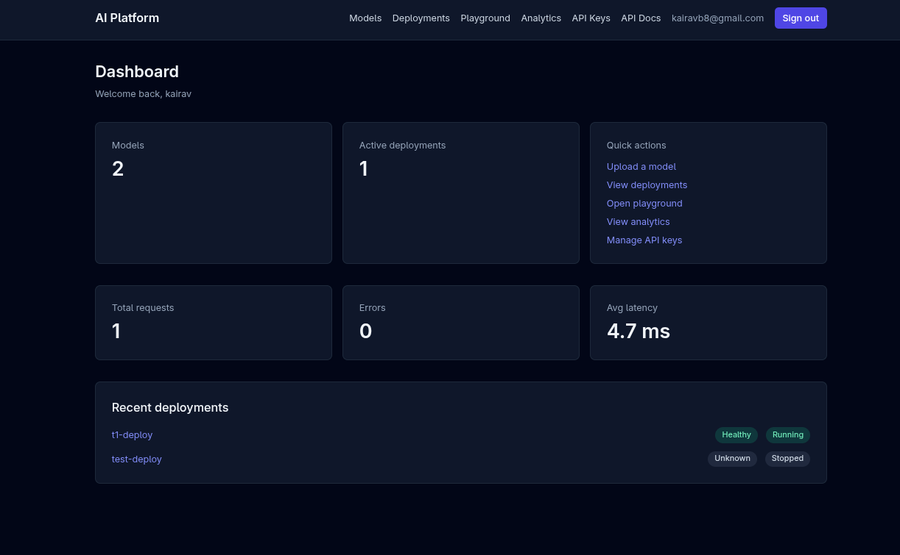
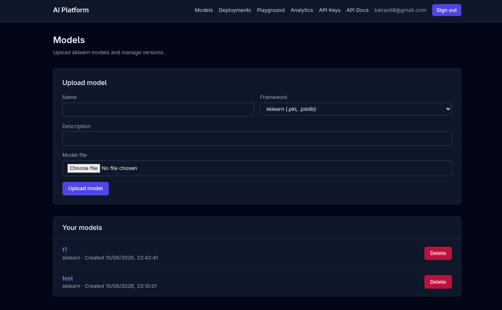
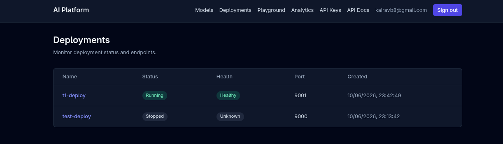
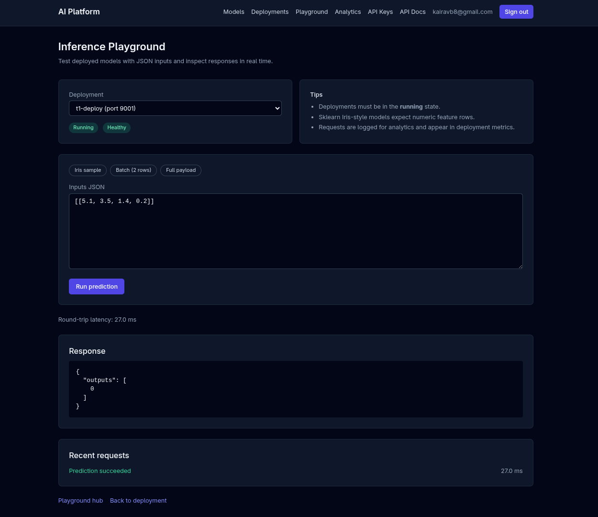
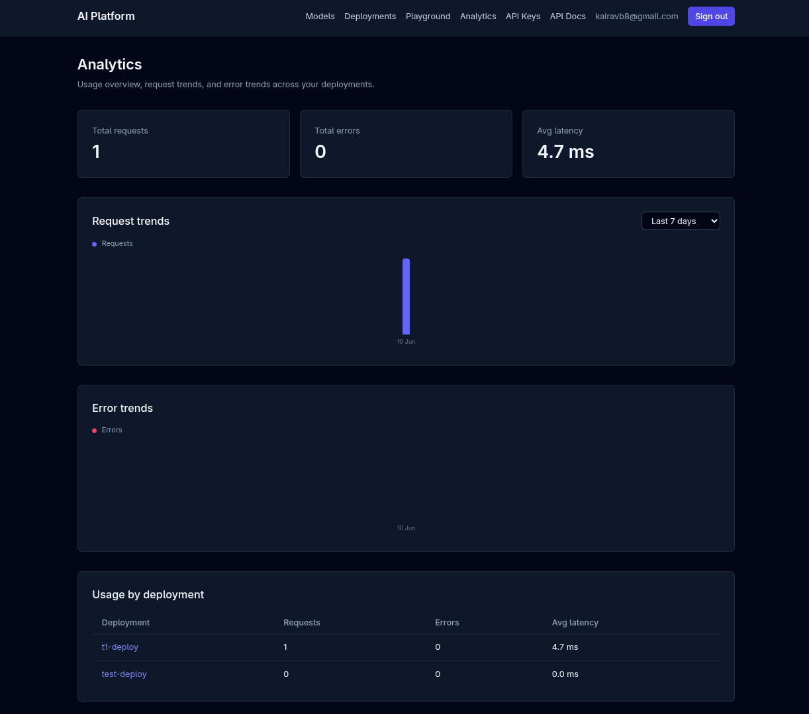

# Cloud-Native AI Deployment Platform

Local-first platform for uploading ML models, deploying them as Dockerized inference services, and managing their lifecycle through a web dashboard.

**Primary entry point:** [http://localhost:8080](http://localhost:8080) (nginx gateway — dashboard + API)

## Screenshots

| Dashboard | Models |
|-----------|--------|
|  |  |

| Deployments | Playground |
|-------------|------------|
|  |  |

| Analytics |
|-----------|
|  |

---

## Table of Contents

- [Screenshots](#screenshots)
- [Prerequisites](#prerequisites)
- [Quick Start](#quick-start)
- [Verify the Platform Is Running](#verify-the-platform-is-running)
- [Access URLs](#access-urls)
- [Using the Platform (End-to-End)](#using-the-platform-end-to-end)
- [Development Mode](#development-mode)
- [Troubleshooting](#troubleshooting)
- [Where to Find Logs and Errors](#where-to-find-logs-and-errors)
- [Configuration](#configuration)
- [Features](#features)
- [Known Limitations](#known-limitations)
- [Repository Layout](#repository-layout)
- [Architecture](#architecture)
- [Tech Stack](#tech-stack)

---

## Prerequisites

Install these before starting:

| Requirement | Version | Notes |
|-------------|---------|-------|
| **Docker** | 24+ | Engine with Compose v2 (`docker compose`) |
| **Docker socket** | — | Backend mounts `/var/run/docker.sock` to build and run inference containers |
| **Git** | — | To clone the repository |
| **Disk space** | ~2 GB+ | Images, model uploads, and per-deployment build contexts |

**Optional (local development without Docker):** Python 3.11+, Node.js 20+, PostgreSQL 16 — see [Development Mode](#development-mode).

**Check your setup:**

```bash
docker --version
docker compose version
docker info    # should succeed without errors
```

---

## Quick Start

Follow these steps in order from the repository root.

### Step 1 — Clone and enter the project

```bash
git clone <your-repo-url> ai-platform
cd ai-platform
```

### Step 2 — Create environment file

```bash
cp .env.example .env
```

The defaults work for local Docker Compose. For anything beyond local development, change `SECRET_KEY` in `.env` to a long random string.

### Step 3 — Initialize storage directories

The backend stores uploaded models, Docker build contexts, and Prometheus target files on disk.

```bash
chmod +x scripts/init-storage.sh
./scripts/init-storage.sh
```

This creates:

```
storage/
├── models/       # uploaded model files
├── builds/       # per-deployment Docker build contexts
└── prometheus/   # inference scrape targets for Prometheus
```

### Step 4 — Start all services

```bash
docker compose up --build
```

**First startup takes a few minutes** while images are built. Wait until you see the backend log line indicating Uvicorn is running.

Leave this terminal open, or run detached:

```bash
docker compose up --build -d
```

### Step 5 — Open the dashboard

Go to **[http://localhost:8080](http://localhost:8080)** and create an account.

> **Tip:** Use the nginx gateway on port **8080** as your main URL. It serves the React dashboard and proxies API requests to the backend.

### Step 6 — Stop the platform

```bash
# If running in the foreground: Ctrl+C, then:
docker compose down

# Remove database volumes as well (wipes all data):
docker compose down -v
```

---

## Verify the Platform Is Running

### 1. Container health

```bash
docker compose ps
```

All services should show `running` (and `healthy` for `postgres` and `backend` once ready).

### 2. Platform health endpoints

```bash
# Liveness — API process is up
curl http://localhost:8080/api/v1/health

# Readiness — database and Docker are reachable
curl http://localhost:8080/api/v1/ready
```

Expected responses:

```json
{"status":"ok"}
```

```json
{"status":"ok","database":"ok","docker":"ok"}
```

If `ready` returns `"status":"degraded"`, check the [Troubleshooting](#troubleshooting) section — usually PostgreSQL or Docker socket access.

### 3. API documentation

Open **[http://localhost:8080/docs](http://localhost:8080/docs)** — the interactive Swagger UI should load.

---

## Access URLs

| What | URL | Credentials |
|------|-----|-------------|
| **Dashboard (recommended)** | [http://localhost:8080](http://localhost:8080) | Your registered user |
| **API (via gateway)** | [http://localhost:8080/api/v1](http://localhost:8080/api/v1) | JWT or API key |
| **API docs** | [http://localhost:8080/docs](http://localhost:8080/docs) | — |
| **Frontend (direct)** | [http://localhost:3000](http://localhost:3000) | Same as dashboard |
| **Backend (direct)** | [http://localhost:8000/api/v1](http://localhost:8000/api/v1) | JWT or API key |
| **Prometheus** | [http://localhost:9090](http://localhost:9090) | — |
| **Grafana** | [http://localhost:3001](http://localhost:3001) | `admin` / `admin` (from `.env`) |

**Which URL should I use?**

- **Day-to-day use:** `http://localhost:8080` — single origin for UI and API.
- **Debugging the API directly:** `http://localhost:8000` — bypasses nginx.
- **Hot-reload frontend (dev mode):** `http://localhost:3000` — see [Development Mode](#development-mode).

---

## Using the Platform (End-to-End)

This walkthrough uploads a scikit-learn model, deploys it, and runs a prediction.

### 1. Create a sample model file

On your host machine (outside Docker), create a small sklearn model:

```bash
python3 - <<'EOF'
import pickle
from sklearn.datasets import load_iris
from sklearn.linear_model import LogisticRegression

X, y = load_iris(return_X_y=True)
model = LogisticRegression(max_iter=200).fit(X, y)

with open("iris_model.pkl", "wb") as f:
    pickle.dump(model, f)

print("Created iris_model.pkl")
EOF
```

Supported formats: `.pkl` and `.joblib`. Only **sklearn** models can be deployed today.

### 2. Register and log in

1. Open [http://localhost:8080](http://localhost:8080)
2. Click **Sign up** and create an account
3. You land on the **Dashboard**

### 3. Upload a model

1. Go to **Models** → **New model**
2. Name it (e.g. `iris-classifier`), framework **sklearn**
3. Open the model detail page → **Upload version**
4. Select `iris_model.pkl` and upload
5. Wait for the version to show status **validated**

### 4. Create a deployment

1. Go to **Deployments** → **New deployment**
2. Pick your model version and give the deployment a name
3. Click **Deploy**

**Expect 30–60 seconds** while the backend builds a Docker image and starts the container. The deployment status moves: `pending` → `starting` → `running`.

If it stays on `starting` or becomes `failed`, see [Troubleshooting](#troubleshooting).

### 5. Run a prediction

**Option A — Playground (UI)**

1. Open **Playground** (or the deployment detail page → Playground tab)
2. Select your running deployment
3. Use the Iris sample input: `[[5.1, 3.5, 1.4, 0.2]]`
4. Click **Predict** — you should see outputs and latency

**Option B — curl (API)**

Log in via the API to get a JWT:

```bash
TOKEN=$(curl -s -X POST http://localhost:8080/api/v1/auth/login \
  -H "Content-Type: application/json" \
  -d '{"email":"you@example.com","password":"your-password"}' \
  | python3 -c "import sys,json; print(json.load(sys.stdin)['access_token'])")
```

List deployments to get the deployment ID:

```bash
curl -s http://localhost:8080/api/v1/deployments \
  -H "Authorization: Bearer $TOKEN" | python3 -m json.tool
```

Run a prediction (replace `DEPLOYMENT_ID`):

```bash
curl -s -X POST "http://localhost:8080/api/v1/deployments/DEPLOYMENT_ID/predict" \
  -H "Authorization: Bearer $TOKEN" \
  -H "Content-Type: application/json" \
  -d '{"inputs": [[5.1, 3.5, 1.4, 0.2]]}' | python3 -m json.tool
```

Expected response:

```json
{
  "outputs": [0]
}
```

**Option C — API key**

1. Go to **API Keys** in the dashboard
2. Create a key (shown once — copy it)
3. Use `Authorization: Bearer apk_…` instead of the JWT

### 6. Inspect deployment details

On the deployment detail page you can:

- View **metrics** (request count, errors, average latency)
- Read **container logs**
- Review **event history** (created, starting, healthy, failed, …)
- **Stop**, **redeploy**, or **rollback** to a previous model version

### 7. View analytics and observability

- **Analytics** page — usage by deployment and daily request/error trends
- **Grafana** ([http://localhost:3001](http://localhost:3001)) — pre-provisioned platform dashboard
- **Prometheus** ([http://localhost:9090](http://localhost:9090)) — raw metrics and targets

---

## Development Mode

For backend hot-reload and Vite dev server:

```bash
docker compose -f docker-compose.yml -f docker-compose.dev.yml up --build
```

| Change | Dev mode behavior |
|--------|-------------------|
| Backend | Auto-reloads on `./backend` and `./deployment_engine` changes |
| Frontend | Vite dev server at [http://localhost:3000](http://localhost:3000) |
| Database | Exposed on `localhost:5432` for local tools |

The gateway at [http://localhost:8080](http://localhost:8080) still works. Ensure `VITE_API_BASE_URL` in `.env` points to the gateway:

```
VITE_API_BASE_URL=http://localhost:8080/api/v1
```

---

## Troubleshooting

### Services won't start

```bash
# See which container failed
docker compose ps

# Read startup errors
docker compose logs postgres
docker compose logs backend
```

| Symptom | Likely cause | Fix |
|---------|--------------|-----|
| `port is already allocated` | Another process uses 5432, 8000, 3000, 8080, 9090, or 3001 | Stop the conflicting service or change ports in `.env` |
| `Cannot connect to the Docker daemon` | Docker not running | Start Docker Desktop / `systemctl start docker` |
| Backend exits immediately | DB not ready or migration error | `docker compose logs backend` — look for Alembic errors |
| `SECRET_KEY must be set` | `APP_ENV=production` with default secret | Set a strong `SECRET_KEY` in `.env` |
| `invalid input value for enum deploymentstatus: "RUNNING"` | Backend crash on startup (enum mismatch) | Rebuild backend: `docker compose up --build backend` |

### Dashboard loads but API calls fail

If nginx returns **502 Bad Gateway** for `/api/v1/*`, the backend is usually down. Check:

```bash
docker compose ps backend          # should be "running", not restarting
docker compose logs --tail=50 backend
```

Common cause: backend crashed during startup (see backend logs). After fixing, rebuild and restart:

```bash
docker compose up --build -d backend
curl http://localhost:8080/api/v1/health   # expect {"status":"ok"}
```

1. Confirm backend is healthy: `curl http://localhost:8080/api/v1/ready`
2. Check browser dev tools → **Network** tab for failed requests
3. Verify `VITE_API_BASE_URL` in `.env` matches how you access the app (use port **8080** when using the gateway)
4. After changing `.env`, rebuild the frontend: `docker compose up --build frontend`

### Deployment stuck on `starting` or shows `failed`

Deployments build a Docker image synchronously — this is normal for 30–60 seconds.

```bash
# Backend logs show build and container output
docker compose logs -f backend
```

| Symptom | Likely cause | Fix |
|---------|--------------|-----|
| `DEPLOYMENT_FAILED` | Docker build error, health check timeout | Check backend logs; open deployment **Logs** tab in UI |
| `All connection attempts failed` | Inference container not reachable yet, or it crashed on startup | Wait and **redeploy**; check steps below |
| `MODEL_FILE_MISSING` | Model file not on disk | Re-upload the model version |
| `DEPLOYMENT_LIMIT_REACHED` | More than 5 active deployments | Stop or delete unused deployments |
| `No host ports available` | Ports 9000–9999 exhausted | Stop old inference containers: `docker ps` and remove stale ones |

Check inference containers directly:

```bash
docker ps --filter "label=ai-platform.deployment_id"
```

#### `Deployment failed: All connection attempts failed`

This means the backend started an inference container but could not reach it on the Docker network — usually because the server was still starting, or the container crashed while loading your model.

**What to do (in order):**

1. **Redeploy** — open the deployment → **Redeploy** (or delete and create again). Image build is cached, so the second attempt is faster.

2. **Check the model file** — must be a valid **scikit-learn** `.pkl` or `.joblib` file trained with a compatible sklearn version. Re-create with the README sample script if unsure.

3. **Inspect backend logs** during deploy:

```bash
docker compose logs -f backend
```

Look for `Building image`, `Starting container`, then errors.

4. **Check for a crashed inference container** (right after a failed deploy):

```bash
docker ps -a | grep inference-
docker logs inference-<deployment-id>   # if the container still exists
```

5. **Confirm Docker networking** — backend and inference containers must share the `ai-platform-net` network (default in `docker compose`).

6. **Increase the health timeout** in `.env` if builds are slow:

```
DEPLOYMENT_HEALTH_TIMEOUT_SECONDS=120
```

Then restart: `docker compose up -d backend`

### Predictions return errors

| HTTP code | Meaning | What to check |
|-----------|---------|---------------|
| `401` | Not authenticated | Log in again or refresh API key |
| `409` | Deployment not running | Wait for `running` status or redeploy |
| `502` | Inference container unreachable | Deployment logs; `docker ps` for the container |
| `400` | Bad input shape | Use `{"inputs": [[...]]}` matching model features |

API error responses include a `request_id` — use it to find the matching line in backend logs.

### Database issues

```bash
# Connect to Postgres inside the stack
docker compose exec postgres psql -U aiplatform -d aiplatform

# Reset everything (destroys data)
docker compose down -v
./scripts/init-storage.sh
docker compose up --build
```

Migrations run automatically on backend startup (`alembic upgrade head`).

---

## Where to Find Logs and Errors

### Docker Compose logs (first place to look)

```bash
# All services, follow output
docker compose logs -f

# Single service
docker compose logs -f backend
docker compose logs -f frontend
docker compose logs -f nginx
docker compose logs -f postgres
```

### Backend application logs

Structured log lines include `request_id`, `method`, and `path`:

```
request_completed request_id=… method=POST path=/api/v1/deployments/…/predict status=200 duration_ms=42.1
```

Search by `request_id` when the UI or API returns an error with that field.

```bash
docker compose logs backend 2>&1 | grep "YOUR_REQUEST_ID"
```

### Deployment container logs

- **Dashboard:** Deployment detail → **Logs** tab
- **API:** `GET /api/v1/deployments/{id}/logs`
- **Docker:** `docker logs <container_id>`

### Inference request history

- **Dashboard:** Deployment detail → inference logs / Playground history
- **API:** `GET /api/v1/deployments/{id}/inference-logs`

### Prometheus and Grafana

- Prometheus targets: [http://localhost:9090/targets](http://localhost:9090/targets) — shows whether inference containers are being scraped
- Grafana: [http://localhost:3001](http://localhost:3001) — platform dashboard (login `admin` / `admin`)

### On-disk artifacts

| Path | Contents |
|------|----------|
| `storage/models/` | Uploaded model files per user/model/version |
| `storage/builds/` | Per-deployment Docker build contexts |
| `storage/prometheus/inference_targets.json` | Running inference endpoints for Prometheus |

---

## Configuration

Key variables in `.env` (see `.env.example` for the full list):

| Variable | Default | Purpose |
|----------|---------|---------|
| `SECRET_KEY` | `change-me-to-a-random-secret-key` | JWT signing — **change for non-local use** |
| `DATABASE_URL` | `postgresql+asyncpg://…@postgres:5432/…` | PostgreSQL connection |
| `VITE_API_BASE_URL` | `http://localhost:8080/api/v1` | Frontend → API URL (baked in at build time) |
| `NGINX_PORT` | `8080` | Gateway port |
| `MAX_DEPLOYMENTS_PER_USER` | `5` | Active deployment limit |
| `MAX_UPLOAD_SIZE_MB` | `500` | Model upload size cap |
| `INFERENCE_HOST_PORT_MIN/MAX` | `9000` / `9999` | Host ports for inference containers |

---

## Features

- **Auth** — signup, login, JWT, API keys (`apk_…`)
- **Model registry** — upload sklearn models (`.pkl`, `.joblib`), versioning, delete
- **Deployments** — Docker image build per deployment, start/stop/redeploy/rollback
- **Inference** — authenticated `/predict` proxy with request logging
- **Monitoring** — health/readiness, per-deployment stats, Prometheus metrics
- **Analytics** — usage summaries and daily trend charts
- **Dashboard** — models, deployments, playground, API keys, analytics

---

## Known Limitations

- **sklearn only** — ONNX and PyTorch image templates exist but are not wired to deployments
- **Synchronous deploy** — `POST /deployments` blocks until the container is healthy (30–60 s)
- **Docker socket** — backend needs host Docker access to build and run inference containers
- **No log retention policy** — `inference_logs` grow until manually cleaned

---

## Repository Layout

```
ai-platform/
├── backend/              # FastAPI monolith
├── deployment_engine/    # Docker deployment engine (imported by backend)
├── frontend/             # React + TypeScript dashboard
├── docs/                 # Architecture and structure docs
├── inference/            # Inference server image templates
├── infra/                # nginx, Prometheus, Grafana config
├── scripts/              # init-storage.sh, build-inference-images.sh
└── storage/              # Runtime data (gitignored — created by init-storage.sh)
```

---

## Architecture

System design, API surface, database entities, and state machine are documented in [`docs/ARCHITECTURE.md`](docs/ARCHITECTURE.md).

Module layout and conventions: [`docs/STRUCTURE.md`](docs/STRUCTURE.md).

---

## Tech Stack

| Layer | Technologies |
|-------|--------------|
| Frontend | React, TypeScript, TailwindCSS, Vite |
| Backend | FastAPI, Python 3.11, SQLAlchemy, Alembic |
| Database | PostgreSQL 16 |
| Deployment | Docker, Docker Compose |
| Gateway | nginx |
| Observability | Prometheus, Grafana |
